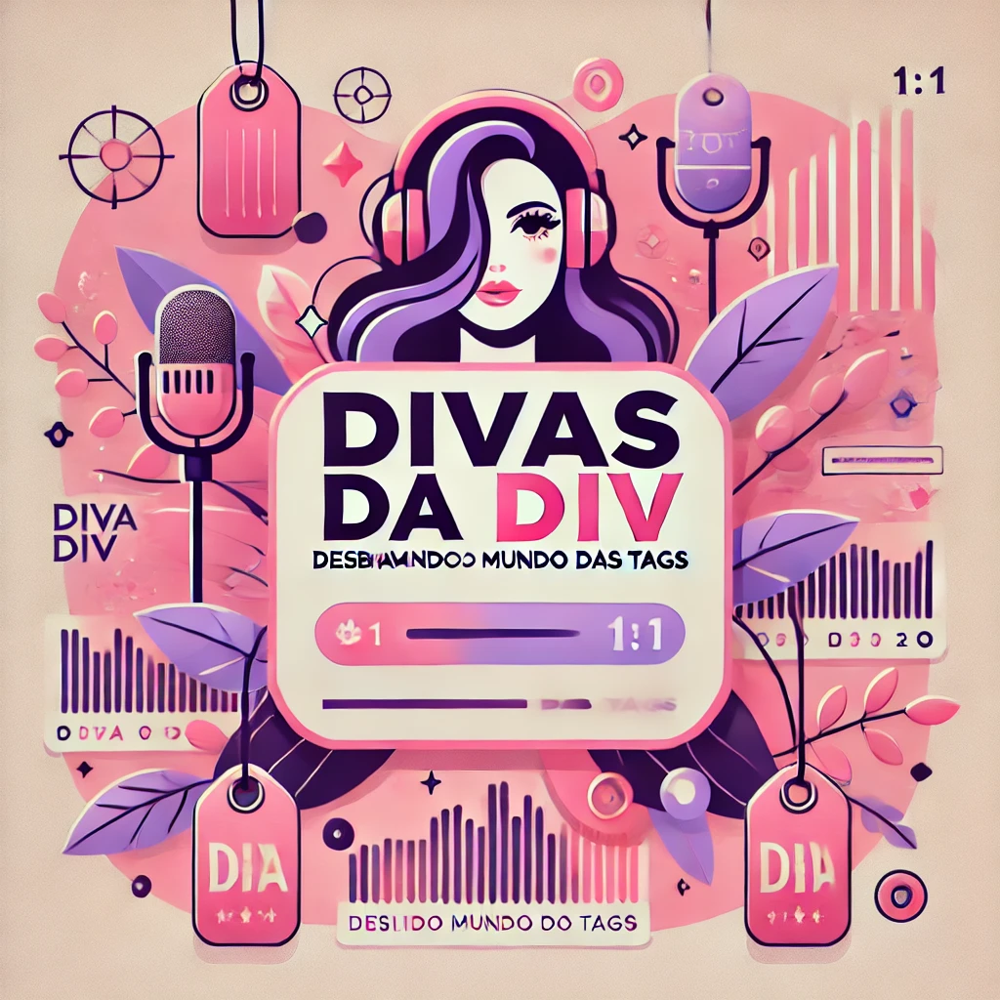

# Projeto Podcast_Divas_da_DIV

 > ℹ️ **NOTE:** Este é o repositório desenvolvido durante o curso que realizei na plataforma da [DIO](https://dio.me)

Projeto com o objetivo de gerar um Podcast com as facilidades das ferramentas de IA. todos os prompts
seguem abaixo.

    preview do podcast

  <a href="https://github.com/LiaGuimaraes/Podcast_Divas_da_DIV/blob/main/Divas%20da%20DIV.mp3"> 📕Clique aqui para escutar</a>

## 💻 Tecnologias utilizadas no projeto

- [ChatGPT](https://chat.openai.com/) 
- [ElevenLabs](https://beta.elevenlabs.io/)
- [Filmora](https://filmora.wondershare.net/)

## ✨ Como foi feito ?

- Roteiro gerado via chatgpt
- Audio gerado pela elevenLabs
- chatgpt para gerar capas
- Filmora para tratar aúdio e adicionar sons de fundo

  ChatGPT：

|   Ação   | prompt                                                                                                                                                                                                                                                                         |
| :------: | ------------------------------------------------------------------------------------------------------------------------------------------------------------------------------------------------------------------------------------------------------------------------------ |
|  título  | Você é um roteirista de podcasts e vamos criar um podcast de tecnologia focado em frontend e eu gostaria de 5 sugestões de nomes criativos para um podcast de frontend para mulheres iniciantes nesta área, com algum trocadilho gentil. Utilizando o nome Divas do div, me sugira 3 subtítulos {REGRAS} - O subtítulo deve conter alguma palavra que remeta a frontend - Não quero palavras em inglês
|  Imagem de capa_  | Criarei um podcast que se chamara “Divas da DIV - Desbravando o mundo das tags". Me sugira 5 capas |
| conteúdo | O formato do roteiro deve ser:[INTRODUÇÃO][CURIOSIDADE 1][CURIOSIDADE 2][FINALIZAÇÃO]
| REGRAS |  •	No bloco [INTRODUÇÃO] utilize analogias de skincare •	No bloco [CURIOSIDADE 1] substitua por uma curiosidade de HTML e CSS•	No bloco [Curiosidade 2] substitua por uma curiosidade sobre ferramentas para front end•	No bloco [FINALIZAÇÃO] substitua por uma despedida que conte que o próximo programa daremos exemplos práticos da utilização do HTML e CSS na criação de uma página web com o final: Eu sou a Lia, e estarei sempre por aqui para construirmos juntas uma trilha de aprendizagem e descobertas!•	Use termos de fácil explicação, sempre utilizando analogias com o dia a dia de uma mulher que gosta de se cuidar•	O podcast vai ser apresentado somente por uma pessoa chamada Lia•	O podcast deve ser curto
| REGRAS NEGATIVAS | •	Não use muitos termos técnicos•	Não use termos em inglês•	Não ultrapasse 5 minutos de duração
 

